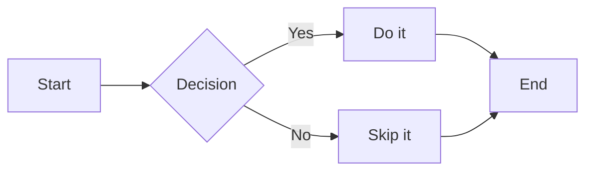
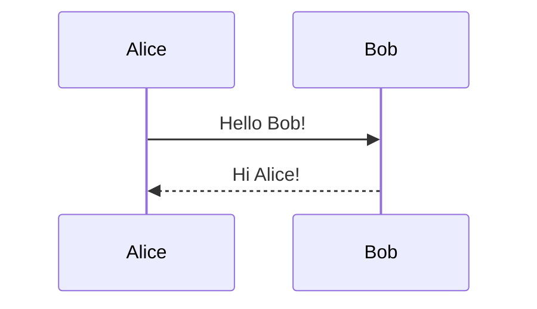

# Mermaid Error Test

## Valid diagram (should render fine)



## Bad syntax (should show compact error badge)

```mermaid
flowchart LR
    A[Start --> B{Missing bracket
    B -->|Yes C[Oops
    ??? invalid tokens here @@
```

## Another valid diagram (should render fine — layout stays stable)


